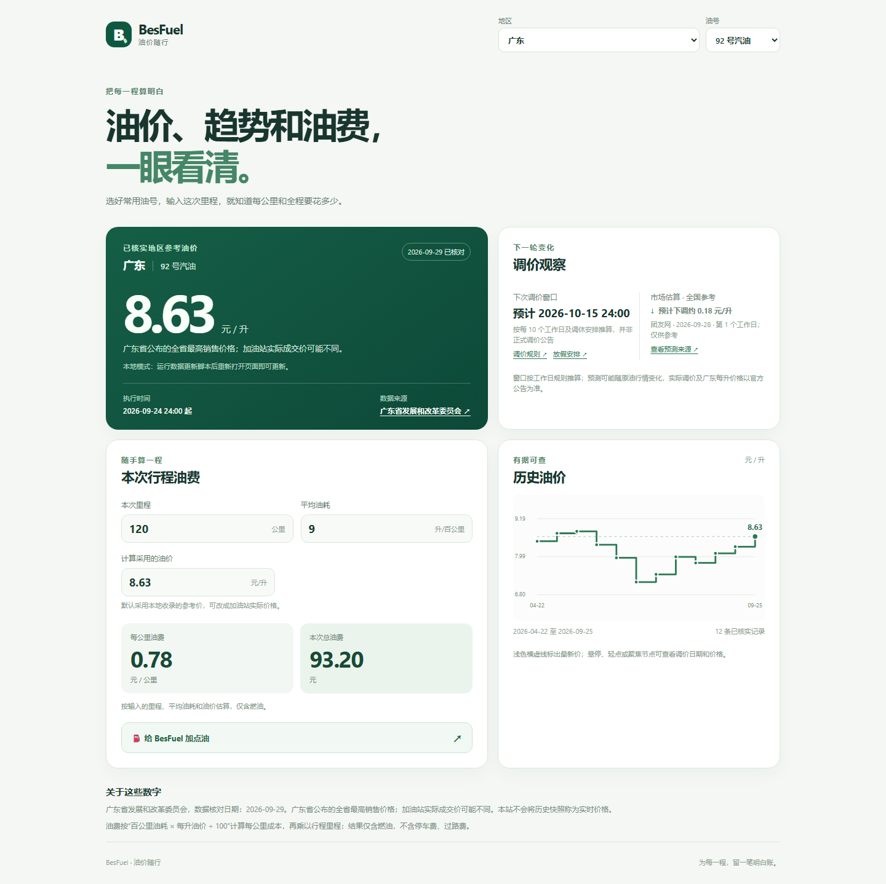

# BesFuel · 油价随行

面向国内燃油车主的免费、无广告单页看板：查看已接入地区的参考油价、调价观察与历史趋势，并计算每公里和本次行程的油费。

**在线使用：[打开 BesFuel](https://bensonlaur.github.io/BesFuel/)**

## 页面预览



截图使用 2026-09-29 的数据快照，以广东 92 号汽油和 120 公里行程为例；截图价格不代表当前价格。

## 如何使用

1. 打开在线页面；也可以下载仓库后直接双击 `index.html`，无需安装依赖或启动服务。
2. 选择地区和油号。价格卡片会显示参考价、适用范围、数据来源和核对日期；历史图可查看已核实的价格变化。
3. 输入本次里程和百公里油耗，即可查看每公里与全程油费。默认使用已收录的参考价，也可输入加油站实际成交价。

常用地区、油号和百公里油耗保存在当前浏览器本地。直接打开本地文件时，页面使用仓库内置的数据快照；通过 HTTP(S) 访问时，页面还会在后台检查本站的 `data/prices.json`，有更新就刷新报价和趋势。

油费仅计算燃油成本：每公里油费 = 百公里油耗 × 每升油价 ÷ 100；全程油费 = 每公里油费 × 本次里程，不包括停车费、过路费等。

## 主要功能

- 展示已接入地区或价区的 92、95 号汽油及 0 号柴油官方参考价，并附公告来源和核对日期；缺少可靠价格时明确显示缺价。
- 根据已核实的公告绘制历史阶梯趋势图，支持鼠标、触摸和键盘查看节点日期与价格。
- 分开显示已生效地区价格、推算的下次调价窗口和第三方全国市场估算；本轮估算超过两天后保留数值、日期和来源，弱化显示并标注仅作历史参考，跨周期后隐藏。
- 根据里程、油耗和每升油价计算行程成本。所有功能免费；自愿支持入口仅在点击后显示。

## 数据说明

页面采用各地公布的最高零售价作为参考，并非加油站实时成交价。98 号及尚未核实的地区不使用邻近地区或其他油号推算；实际油费可用手动输入的成交价计算。已接入地区、价区和历史记录的范围见 [数据维护说明](docs/DATA.md)，仓库数据主文件是 [data/prices.json](data/prices.json)。

下次调价窗口按工作日规则与放假安排推算；涨跌估算来自独立第三方，属于全国参考信息，不是官方公布的当地每升调幅。页面会标明来源与计算日期；超过两天的本轮估算标注陈旧提示，等待本轮更新，跨周期后隐藏旧估算。GitHub Actions 定时执行[数据核对与发布](.github/workflows/pages.yml)，但任务可能延迟，部分图片、PDF 公告仍需人工核价；访客浏览器只读取本站的数据文件，不直接抓取政府网站。

## 开发与验证

直接使用页面不需要 Node.js。运行验证脚本建议使用与 CI 相同的 Node.js 22；`npm run test:updater` 需要 PowerShell，`npm run smoke` 默认使用 Windows Edge，也可通过 `BROWSER_PATH` 指定 Chromium 浏览器。

```powershell
npm test
npm run test:updater
npm run validate:data
npm run smoke
```

更新地区价格和核验来源的方法见 [数据维护说明](docs/DATA.md)；部署流程与实现边界见 [实施方案](docs/IMPLEMENTATION_PLAN.md)。

## 项目结构

```text
BesFuel/
├─ index.html           页面结构
├─ styles.css           响应式样式
├─ app.js               页面交互与历史图
├─ lib/calc.js          计算与输入校验
├─ data/                带来源的价格快照及浏览器副本
├─ resources/support/   微信、支付宝收款原图
├─ scripts/             数据更新和校验脚本
├─ tests/               计算、数据和浏览器验证
├─ docs/                数据维护、使用边界、实施方案和截图
└─ .github/workflows/   定时核对和 Pages 发布
```

## 后续方向

继续接入有可靠官方每升价格的地区、补齐已接入地区的历史记录，并核验市场估算来源的稳定性。收款图片仍需用真实手机持续确认识别结果和收款主体。

## 许可

自编写代码与文档采用 [MIT License](LICENSE)。收款图片、政府公告和其他第三方数据的权利不随代码许可证转移，详情见 [使用边界](docs/RIGHTS.md)。
